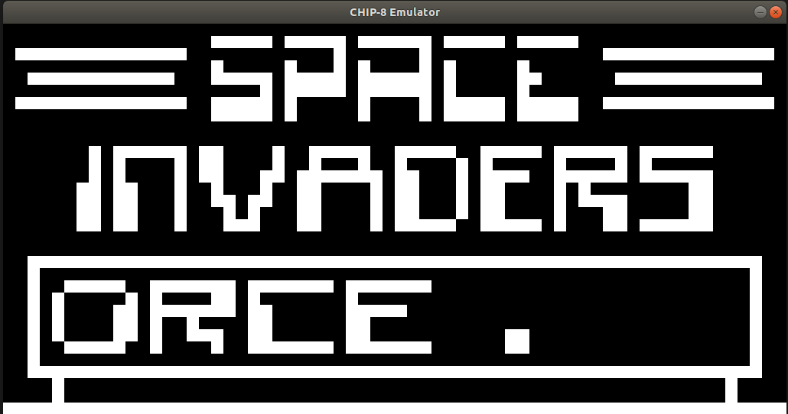

# SDL-CHIP8
C++ Implementation of chip 8 emulator using SDL for graphics 

### Running 

```
install  the development libraries SDL2: sudo apt-get install libsdl2-dev  
intsall c++11  
run the build script in the source directory
run the c8 binary with a path to a rom: ./c8 rooms/INVADERS

```

